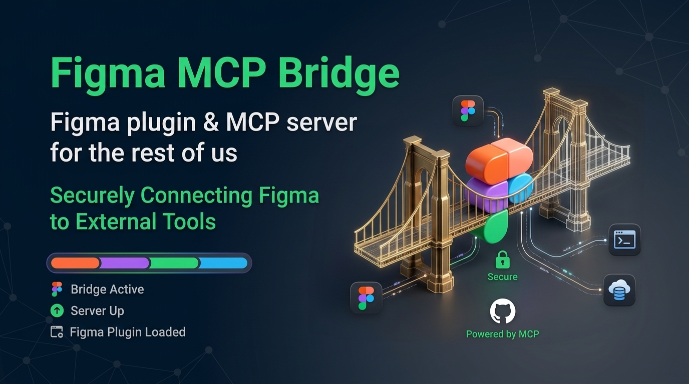

<div align="center">



**Bridge Figma documents to AI agents through the Model Context Protocol — no Figma API rate limits, no API tokens, no cloud round-trips.**

[](https://www.npmjs.com/package/@maxisoft/figma-mcp-bridge)
[](./LICENSE.md)
[](https://nodejs.org)

</div>

---

## What is this?

**Figma MCP Bridge** is a two-part system that lets any MCP-compatible AI agent (Claude Desktop, Claude Code, Cursor, Windsurf, Cline, etc.) read, edit, and reason about live Figma documents.

It consists of:

1. **MCP Server** (`@maxisoft/figma-mcp-bridge`) — a Node.js process that implements the [Model Context Protocol](https://modelcontextprotocol.io/) and exposes **75 Figma-aware tools** to your AI agent.
2. **Figma Plugin** (private, in this repo) — a Figma plugin that runs inside the Figma sandbox, executes the tools against the real Figma document, and reports results back to the server over a local WebSocket.

A side-channel WebSocket on `ws://localhost:1994` connects the two. There is no cloud service in the loop — everything happens on your machine.

## Why?

Figma's public REST API is rate-limited (60 requests / minute per user), requires personal access tokens, and doesn't expose the rich node model that the desktop app uses (auto-layout, bound variables, effects hierarchy, instance overrides, etc.). This bridge talks to Figma **through the desktop plugin API**, which is the same API the Figma editor itself uses — full fidelity, no rate limits.

## Features

- **75 tools** for reading, editing, and analysing Figma documents
- **Multi-file** — connect several Figma files at once, switch between them per tool call
- **Dev Mode Mirror** — the plugin's own UI is a Dev Mode panel: pick a node, see its CSS/SVG/HTML/JSON/IMG exports side-by-side with the real Figma file
- **Design tokens** — extract variables, paint styles, text styles, effect styles, grid styles as a structured manifest; re-apply them to another file
- **Style + lock** — soft-lock the plugin from the UI so the agent can't accidentally mutate it
- **WebSocket keepalive** — application-level `__server_ping` / `__client_pong` pair detects half-open TCP connections that the OS can't notice (Figma reloads the iframe without sending a close frame)
- **Standalone sprite exporter** — `scripts/export-via-rpc.mjs` dumps every SVG icon in the file to a single `<symbol>`-based sprite, with no dedup (you choose how to collapse)
- **No telemetry**, no analytics, no phoning home

## Architecture

```
┌────────────────────────────────────────────────────────────────────┐
│  Your machine                                                      │
│                                                                    │
│   ┌────────────┐  JSON-RPC /stdio   ┌────────────────────────┐      │
│   │ AI agent   │ ◄────────────────► │  MCP server (Node.js)  │      │
│   │ (Claude,   │   tools/call       │  @maxisoft/            │      │
│   │  Cursor,   │   tools/list       │  figma-mcp-bridge      │      │
│   │  Cline, …) │                    │                        │      │
│   └────────────┘                    │  75 tools registered   │      │
│        ▲                            │  leader/follower       │      │
│        │                            │  election (1994)       │      │
│        │ MCP tool call              │                        │      │
│        │                            └──────────┬─────────────┘      │
│        │                                       │                    │
│        │                                       │ ws://localhost:    │
│        │                                       │      1994/ws       │
│        │                                       ▼                    │
│        │                            ┌─────────────────────┐       │
│        │                            │  Figma plugin       │       │
│        │                            │  (in Figma sandbox) │       │
│        │                            │                     │       │
│        │                            │  React UI ←──────►  │       │
│        │                            │  main thread ──►    │       │
│        │                            │  figma.* API calls  │       │
│        │                            └─────────┬───────────┘       │
│        │                                      │                    │
│        │                                      ▼                    │
│        │                            ┌─────────────────────┐       │
│        └──── tool result ────────── │  Real Figma doc     │       │
│                                     │  (your design)     │       │
│                                     └─────────────────────┘       │
│                                                                    │
└────────────────────────────────────────────────────────────────────┘
```

The AI agent and Figma plugin never talk directly. The MCP server is the only component that crosses the boundary.

## Quick start

### 1. Add the MCP server to your AI client

Claude Desktop, Claude Code, Cursor, Cline, Windsurf, etc. all use the same MCP config format. Drop this into your MCP settings file:

```json
{
  "mcpServers": {
    "figma-bridge": {
      "command": "npx",
      "args": ["-y", "@maxisoft/figma-mcp-bridge"],
      "env": {
        "ALLOWED_ORIGINS_INCLUDE_NULL": "1"
      }
    }
  }
}
```

`ALLOWED_ORIGINS_INCLUDE_NULL=1` is required for Figma desktop (the iframe reports `Origin: null`, which the server blocks by default). If you run Figma exclusively in a browser tab, you can omit it.

### 2. Install the plugin in Figma

1. In Figma, open the file you want to work with.
2. `Plugins → Development → Import plugin from manifest…`
3. Select `plugin/manifest.json` from this repository.
4. The plugin appears in your `Plugins → Development` list as **Figma MCP Bridge**.

### 3. Run the plugin

1. With the file open, run `Plugins → Development → Figma MCP Bridge`.
2. The plugin panel shows the connection status (green dot = connected).
3. From your AI agent, invoke any tool. The agent can list files, walk the document tree, read or write nodes, etc.

### 4. Try it

In your AI agent, ask:

> List the connected Figma files.

The agent will call `list_files` and report back. From there, every other tool becomes available.

## Documentation

- **English**
  - [Plugin UI & lifecycle](./docs/en/plugin.md) — what the plugin panel does, hotkeys, message protocol
  - [MCP server](./docs/en/server.md) — leader/follower election, the `/rpc` endpoint, keepalive, request flow
  - [Tool reference](./docs/en/tools.md) — every tool, grouped by purpose, with input/output shapes
  - [Architecture](./docs/en/architecture.md) — why two processes, what data flows where, what runs where

- **Русский**
  - [Плагин](./docs/ru/plugin.md)
  - [MCP-сервер](./docs/ru/server.md)
  - [Список инструментов](./docs/ru/tools.md)
  - [Архитектура](./docs/ru/architecture.md)

## Example: from prompt to result

> **You:** "In the connected Figma file, show me the node at `1409:32080` and tell me its auto-layout properties."

The agent executes:

```json
{
  "tool": "get_node",
  "params": {
    "nodeId": "1409:32080",
    "fileKey": "oAKWWJ9y0BTH1XPmnYvGLw",
    "depth": 2
  }
}
```

And receives:

```json
{
  "id": "1409:32080",
  "name": "Авторизован",
  "type": "FRAME",
  "bounds": { "x": 0, "y": 0, "width": 360, "height": 56 },
  "absoluteBounds": { "x": 464, "y": 1154, "width": 360, "height": 56 },
  "styles": {
    "fills": [{ "type": "SOLID", "color": "#2047cf", "opacity": 1 }],
    "autoLayout": {
      "direction": "HORIZONTAL",
      "primaryAxisAlign": "SPACE_BETWEEN",
      "counterAxisAlign": "MAX",
      "padding": { "top": 8, "right": 16, "bottom": 8, "left": 16 },
      "gap": 32
    }
  },
  "children": [
    { "id": "1409:32106", "name": "hugeicons:youtube", "type": "INSTANCE" },
    { "id": "1409:32109", "name": "solar:bell-linear", "type": "FRAME" },
    { "id": "1409:32117", "name": "solar:wallet-linear", "type": "FRAME" }
  ]
}
```

From there the agent can decide to rename, re-style, or extract the design tokens.

## Example: export every icon as a sprite

Standalone Node script, no AI client required:

```bash
cd /path/to/figma-mcp-bridge
node scripts/export-via-rpc.mjs \
  --fileKey oAKWWJ9y0BTH1XPmnYvGLw \
  --out ./icons.svg \
  --pattern "hugeicons|solar|iconamoon" \
  --max 1000
```

Output: a single `icons.svg` with one `<symbol id="…">` per icon (auto-numbered `-2`, `-3` on name collisions). Useful as a starting point for an icon pipeline.

## Project structure

```
.
├── plugin/              # Figma plugin (React UI + sandboxed main thread)
│   ├── manifest.json    # Figma plugin manifest (with enablePrivatePluginApi)
│   ├── src/main/        # Sandbox code: code.ts (entry), router.ts, 75 handlers/
│   ├── src/ui/          # React UI (App.tsx, components/, hooks/)
│   └── src/types/       # Wire protocol types shared with main thread
│
├── server/              # MCP server (Node.js, published to npm)
│   ├── src/
│   │   ├── index.ts          # Entry point (MCP stdio + WebSocket on :1994)
│   │   ├── tools.ts          # Registers 75 tools
│   │   ├── schema.ts         # Zod schemas for every tool's input
│   │   ├── bridge.ts         # WebSocket bridge (Figma plugin ↔ server)
│   │   ├── leader.ts         # HTTP + WS upgrade on :1994
│   │   ├── follower.ts       # Forwards RPC to leader
│   │   ├── election.ts       # Leader/follower election
│   │   └── sprite.ts         # buildSprite() pure function for export_icon_sprite
│   └── dist/                  # Compiled output
│
├── scripts/             # Standalone CLI tools
│   └── export-via-rpc.mjs     # Dump every SVG in a Figma file to a sprite
│
├── docs/                # User-facing documentation
│   ├── en/
│   └── ru/
│
├── logo.png             # README hero
├── README.md            # You are here
├── LICENSE.md
├── CHANGELOG.md
├── AGENTS.md            # Notes for AI coding agents
└── .github/workflows/
    └── release.yml      # npm publish + GitHub release zip
```

## Requirements

- Node.js **20+** (see `.nvmrc` — currently 24)
- Figma desktop **or** Figma web
- One MCP-compatible AI client (Claude Desktop, Claude Code, Cursor, Cline, Windsurf, …)

## Building from source

```bash
# server
cd server
npm install
npm run build       # tsc → dist/

# plugin
cd ../plugin
bun install
bun run build       # vite (UI) + vite (main thread) → dist/
```

`plugin/dist/code.js` and `plugin/dist/index.html` are what Figma loads — they're the `main` and `ui` fields in `plugin/manifest.json`.

## Releasing

```bash
# 1. Bump version + commit + tag
./scripts/bump-version.sh 0.12.2 --server --commit    # creates v0.12.2 + tag
# (drop --server to bump only the plugin; use "patch"/"minor"/"major" instead of explicit version)

# 2. Push
git push origin main                                   # CI: tests + build
git push origin v0.12.2                                # publish workflow fires
```

The `publish.yml` workflow:

1. Builds the server (`tsc`) and runs tests
2. Publishes `@maxisoft/figma-mcp-bridge@0.12.2` to npm
3. Builds the plugin (`vite`)
4. Packages `plugin/dist/` + `manifest.json` into a zip
5. Creates a GitHub Release at the tag

Manual publish from your machine:

```bash
cd server
npm publish --access public --registry=https://registry.npmjs.org
```

Manual workflow run (no tag): GitHub → Actions → **Publish** → Run workflow.

## License

[MIT](./LICENSE.md) — see [LICENSE.md](./LICENSE.md) for the full text.

## Acknowledgements

Forked from [gethopp/figma-mcp-bridge](https://github.com/gethopp/figma-mcp-bridge). The MCP server (`@maxisoft/figma-mcp-bridge`) is republished under the `maxisoft` npm scope; the Figma plugin is private to this repo.
